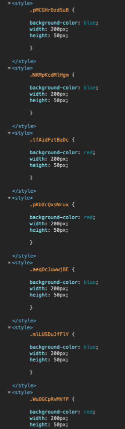
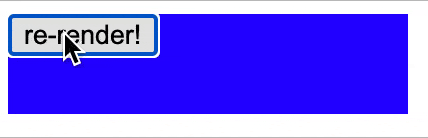

In this article we're going to look at how to use JavaScript's string interpolation and tagged template literals to create a CSS-in-JS library for React. If you haven't worked with React hooks before, I'd recommend taking a look at the [docs](https://reactjs.org/docs/hooks-intro.html) to get an understanding of how they work.

## What is CSS-in-JS?

> If you know what CSS-in-JS is, you can safely skip this part.

CSS-in-JS, as the name implies, is a way of writing CSS using JavaScript. Why can't we just write CSS? We can! It's just that CSS-in-JS offers benefits such as scoping styles and a better developer experience for conditional CSS. If you've spent any time with React, you'll know that you can apply inline styles using the `style` prop. How does CSS-in-JS differ? When working with inline styles, you can't apply things like media-queries, pseudo-selectors, and keyframes. And while our simple implementation won't cover to implement those (in this article anyways), it's good to know what other CSS-in-JS libraries are capable of.

## String Interpolation and Tagged Template Literals

Before we start, we'll quickly cover what string interpolation is. String interpolation allows you to write expressions inside of strings. Take the following:

```js
const name = 'John Doe';

console.log('hello, my name is ' + name + '.'); // "hello, my name is John Doe."
```

Rather than concatenating the name to the end of the string in the `console.log`, we can write:

```js
const name = 'John Doe';

console.log(`hello, my name is ${name}.`); // "hello, my name is John Doe."
```

Tagged template literals are a more advanced form of template literals that allow us to parse template literals with a function. Here's an example:

```js
const taggedTemplate = (strings, name, age) => {
  const str0 = strings[0]; // "My name is "
  const str1 = strings[1]; // " and my age is "

  return age > 80
    ? `${name} isn't old, they're venerable!`
    : `${name} isn't old yet.`;
};

const name = 'John Doe';
const age = 25;

const output = taggedTemplate`My name is ${name} and my age is ${age}`;

console.log(output); // "John Doe isn't old yet."
```

This example my be a little contrived, tagged templates are a very powerful tool for handling dynamic strings. Don't worry if this doesn't make sense yet, we'll cover a real case for tagged templates in the next section.

## Let's Get Started

Phew, that was a lot of explaining. Now that we have the basics, let's figure out exactly what we need to do

1. Write our CSS as a JavaScript string
2. Use string interpolation to pass dyanmic expressions to our CSS
3. Attach our CSS to the DOM
4. Pass our CSS to our React component

With those requirements, let's start with a simple baseline component:

```js
const Sample = () => {
  const [backgroundColor, setBackgroundColor] = useState('blue');

  return (
    <div>
      <button
        onClick={() =>
          setBackgroundColor(backgroundColor === 'blue' ? 'red' : 'blue')
        }
      >
        re-render!
      </button>
    </div>
  );
};
```

The idea behind this component is simple. We want to click a button and toggle the background color from blue to red. Let's try to implement our requirements and change the background color.

```js
const generateUniqueClassName = () => {
  const alphabet = 'qQwWeErRtTyYuUiIoOpPlLkKjJhHgGfFdDsSaAzZxXcCvVbBnNmM';

  return Array(12)
    .fill(null)
    .map(() => alphabet[Math.floor(Math.random() * alphabet.length)])
    .join('');
};

const zipArray = (array1, array2) =>
  array1.reduce((acc, _, i) => {
    const zippedEl =
      array2[i] !== undefined ? [array1[i], array2[i]] : [array1[i]];
    return [...acc, ...zippedEl];
  }, []);

const makeStyles = (styles, ...values) => {
  const className = generateUniqueClassName();

  const styleBlock = zipArray(styles, values).join('');

  const styleContent = `
    .${className} {
      ${styleBlock}
    }
  `;

  const styleEl = document.createElement('style');
  styleEl.textContent = styleContent;
  document.head.appendChild(styleEl);

  return className;
};

const Sample = () => {
  const [backgroundColor, setBackgroundColor] = useState('blue');

  const className = makeStyles`
    background-color: ${backgroundColor};
    width: 200px;
    height: 50px;
  `;

  return (
    <div className={className}>
      <button
        onClick={() =>
          setBackgroundColor(backgroundColor === 'blue' ? 'red' : 'blue')
        }
      >
        re-render!
      </button>
    </div>
  );
};
```

Ok, that was a lot of code. Let's break down exactly what's happening here. Here's the first function:

```js
const generateUniqueClassName = () => {
  const alphabet = 'qQwWeErRtTyYuUiIoOpPlLkKjJhHgGfFdDsSaAzZxXcCvVbBnNmM';

  return Array(12)
    .fill(null)
    .map(() => alphabet[Math.floor(Math.random() * alphabet.length)])
    .join('');
};
```

This is a simple function that generates a random class name. We've omitted numbers and special characters to make sure we don't randomly generate an invalid id.

> If you're curious about what the requirements are for a class name, [here's a link to the spec](https://www.w3.org/TR/CSS21/syndata.html#characters)

The next function is a little more complicated. It takes in two arrays, and "zips" them together:

```js
const zipArray = (array1, array2) =>
  array1.reduce((acc, _, i) => {
    const zippedEl =
      array2[i] !== undefined ? [array1[i], array2[i]] : [array1[i]];
    return [...acc, ...zippedEl];
  }, []);

const array1 = [1, 2, 3, 4];
const array2 = [5, 6, 7, 8];

const array3 = zipArray(array1, array2); // [1, 5, 2, 6, 3, 7, 4, 8]
```

Normally, I would reach for a utility library such as lodash, however for our use case, we need a function that can zip arrays that don't have equal length. Our `zipArray` function provides that solution with one caveat, that the length of the first array is equal to or greater than the size of the second. The reasoning behind this will make more sense after the next function:

```js
const makeStyles = (styles, ...values) => {
  const className = generateUniqueClassName();

  const styleBlock = zipArray(styles, values).join('');

  const styleContent = `
    .${className} {
      ${styleBlock}
    }
  `;

  const styleEl = document.createElement('style');
  styleEl.textContent = styleContent;
  document.head.appendChild(styleEl);

  return className;
};
```

Now we're getting to the meat of the article. This function takes in at least two arguments, zips them together, adds them to a style tag, appends that tag to the `<head>` of the page, and returns a string with a class name.

> If you haven't seen a rest parameter in a function before, it whatever arguments are passed in and collects them into an array. [MDN](https://developer.mozilla.org/en-US/docs/Web/JavaScript/Reference/Functions/rest_parameters) has a good summary on how they work.

Let's take a closer look at how this function builds the style tag. Here's the function we're using in our component

```js
const className = makeStyles`
   background-color: ${backgroundColor};
   width: 200px;
   height: 50px;
 `;
```

When calling the `makeStyles` function, styles equals `['background-color: ', '; width: 200px; height: 50px;']` and values equals `['blue']`

Then we generate our unique class name:

```js
const className = generateUniqueClassName();
```

and use the `zipArray` function to zip our input arguments together.

```js
const styleBlock = zipArray(styles, values).join('');
```

This gives is an array that looks like `['background-color: ', 'blue', '; width: 200px; height: 50px;']` that we join with an empty string giving us `'background-color: blue; width: 200px; height: 50px;'`

```js
const styleContent = `
  .${className} {
    ${styleBlock}
  }
  `;

const styleEl = document.createElement('style');
styleEl.textContent = styleContent;
document.head.appendChild(styleEl);

return className;
};
```

We use this function to build a valid CSS style block, attach it to the DOM and return the className so we can use it in our component like this:

```js
<div className={className}>
  <button
    onClick={() =>
      setBackgroundColor(backgroundColor === 'blue' ? 'red' : 'blue')
    }
  >
    re-render!
  </button>
</div>
```

Now we have CSS-in-JS, easy as pie! Oh wait, lets' click that re-render button a few times and look at our html



That seems... bad. Every time we click the button, a new style tag is generated, and we're not even cleaning up the old one. Let's try turning our makeStyles function into a hook and use `useEffect` to clean up the component after it's done.

```js
const useMakeStyles = (styles, ...values) => {
  const className = generateUniqueClassName();

  const styleBlock = zipArray(styles, values).join('');

  const styleContent = `
    .${className} {
      ${styleBlock}
    }
  `;

  useEffect(() => {
    const styleEl = document.createElement('style');
    styleEl.textContent = styleContent;
    document.head.appendChild(styleEl);

    return () => {
      document.head.removeChild(styleEl);
    };
  });

  return className;
};
```

Since we've turned our function into a custom hook, we've appended 'use' to the front of it. This is not required, but it's convention. Be sure to change it in our `<Sample />` component too!. Look, one style tag in the head now!


But we still have one problem, when changing colors, there's a flash of unstyled content ([FOUC](https://en.wikipedia.org/wiki/Flash_of_unstyled_content#:~:text=A%20flash%20of%20unstyled%20content,before%20all%20information%20is%20retrieved.)).


The problem lies with the `useEffect` hook. When we click the button, the return function of the `useEffect` runs, removing the styles. The updated component is then ran, re-adding our styles. Thankfully, the solution is pretty simple. We'll replace our `useEffect` with `useLayoutEffect`. Now our hook will fire after DOM mutations but **before paint**. So with that, our final version looks like this:

```js
const generateUniqueClassName = () => {
  const alphabet = 'qQwWeErRtTyYuUiIoOpPlLkKjJhHgGfFdDsSaAzZxXcCvVbBnNmM';

  return Array(12)
    .fill(null)
    .map(() => alphabet[Math.floor(Math.random() * alphabet.length)])
    .join('');
};

const zipArray = (array1, array2) =>
  array1.reduce((acc, _, i) => {
    const zippedEl =
      array2[i] !== undefined ? [array1[i], array2[i]] : [array1[i]];
    return [...acc, ...zippedEl];
  }, []);

const useMakeStyles = (styles, ...values) => {
  const className = generateUniqueClassName();

  const styleBlock = zipArray(styles, values).join('');

  const styleContent = `
    .${className} {
      ${styleBlock}
    }
  `;

  useLayoutEffect(() => {
    const styleEl = document.createElement('style');
    styleEl.textContent = styleContent;
    document.head.appendChild(styleEl);

    return () => {
      document.head.removeChild(styleEl);
    };
  });

  return className;
};

const Sample = () => {
  const [backgroundColor, setBackgroundColor] = useState('blue');

  const className = useMakeStyles`
    background-color: ${backgroundColor};
    width: 200px;
    height: 50px;
  `;

  return (
    <div className={className}>
      <button
        onClick={() =>
          setBackgroundColor(backgroundColor === 'blue' ? 'red' : 'blue')
        }
      >
        re-render!
      </button>
    </div>
  );
};
```

And look, no more flash!



Now before you try to use this CSS-in-JS implementation in your own projects, there are a few gaps we'd have to fill first. When using multiple instances of our `<Sample />` component, each component adds it's own style tag to the DOM. That means we could end up with lots of duplicate style tags. To prevent this, we could create some sort of cache to make sure that each instance uses the same style tags. This would mean at most we'd only have as many style tags as permutations of our state. For example, we'd only have at most two style tags for our component, one for the blue background, and one for the red.

Another issue we have, is that we still can't use things like media queries, psuedo-selectors, and keyframes. That could be implemented using a syntax similar to Sass, but that would also involve a lot more string manipulation of our `styleContent` to make sure we parse it into valid CSS.

Next, we don't have any vendor prefixing. While most modern browsers no longer use vendor prefixing, if we plan to support older browsers we would need to add support for it.

The last issue we have is that we have no support for SSR. Since `useLayoutEffect` requires a DOM, it simply won't run on the server. That means we'd go back to having a FOUC for our first paint. To overcome that, we'd have to find a way to append all of our style tags to the HTML the server sends to the browser.

While none of the issues listed above are insurmountable, it's probably best to use an existing CSS-in-JS library, where the listed problems have already been solved.

This article ended up being a bit lengthier than I intended, but I hope you learned something about tagged template functions and CSS-in-JS. The code used in this article can be found in [this repository](https://github.com/cbadger85/tagged-template-example) Thanks for reading!
